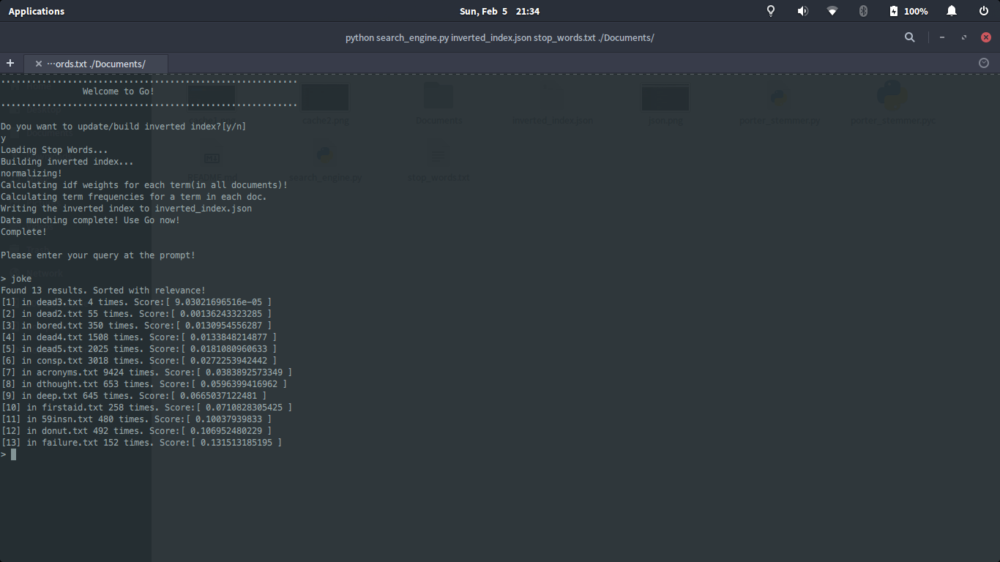
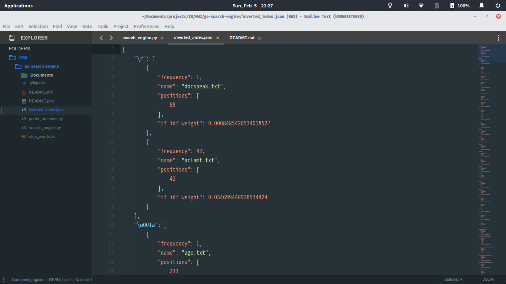

# Go: Search Engine
A basic search engine using tf-idf score. The code and a more readable README can be found on https://github.com/naman/go-search-engine.

[Naman Gupta, 2013064]

# Screenshots

# References

1. Porter stemmer from https://tartarus.org/~martin/PorterStemmer/
2. Stop words from http://xpo6.com/list-of-english-stop-words/
3. Documents taken from http://www.textfiles.com/computers/DOCUMENTATION/. EDIT: Now, http://www.textfiles.com/humor/
(Some files contained special characters, they were ommited since python throws an error while converting special characters to unicode strings.)

# Usage

`python search_engine.py <inverted_index> <stop_words> <path_to_docs>`

`python search_engine.py inverted_index.json stop_words.txt ./Documents/` 

# Features Implemented

1. The code automatically downloads the document from "http://www.textfiles.com/computers/DOCUMENTATION/". (see `loadDocuments()`)

2. Stores the inverted index as a json allowing offline caching (saves precious time, power and those CPU cycles on building the index again) (see `build_index()`, `load_index_in_memory()` and `write_inverted_index_to_file()`). The 
	The inverted index json stores as follows 
	
		term: {
			doc_name,
			frequency,
			score,
			positions[]
		}
	

3. Scoring is done using tf-idf (normalized) formula (see `normalize()`). 

4. Specially handled one word queries, multiword queries and phrase queries with "<query>". Logic for Query results:
	
	a) `OneWordQ()` function: Search for the query term in the inverted index.  
	
	b) `MultiWordQ()` function: Search for the each query term in the inverted index. Take a union of results. Make a set. The output is the list of documents that contain any of the query terms.
	
	c) `PhraseQ()` function: Search for the each query term in the inverted index. Take an intersection of results. In the intersection of result documents, find positions of the query terms for each resulting documents. Take the intersection of positions from a doc d after subtracting the term offset  from the positions. If the intersection is non empty, then we have found a match. A similar algorithm for finding match in phrase queries was also covered in class.
		Eg. "time out" is present in the doc 3_drives.txt. The term offset for time is 0, and out is 1.
					
			find docs for time
			find docs for out
			take intersection
			for each doc in the above intersection,
				compute (positions - offset) 
			take intersection of positions found
			if intersection is non empty, 
				match is found
			else
				no match
			

5. The query can be entered iteratively just like a normal shell. A prompt is visible where the query is entered and results are shown almost instantaneosly.

6. All the results for OneWordQ are sorted according to relevance (sorted scores).
